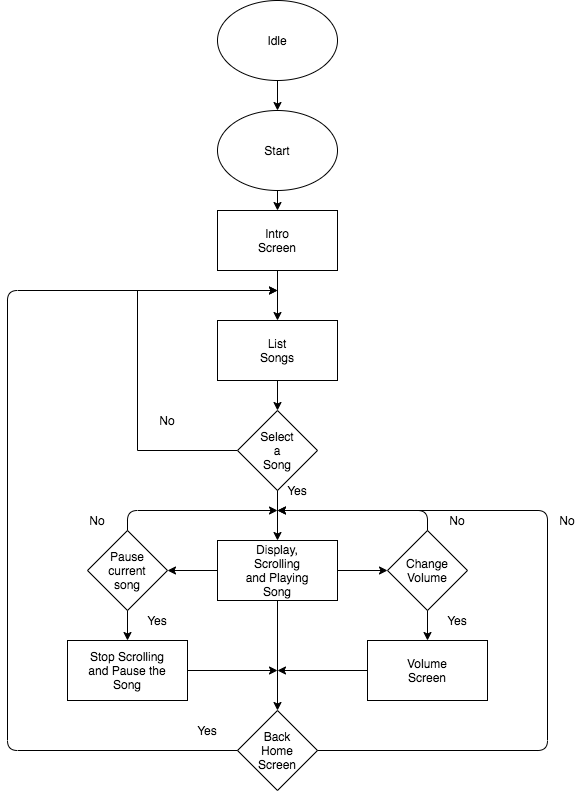
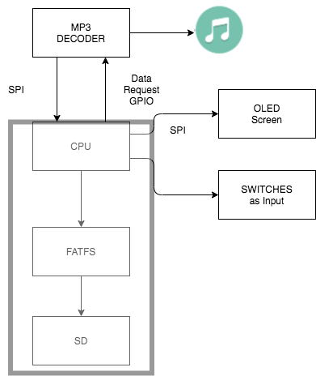

<h1> MP3 PLAYER</h1>

<ol>
<h2 align="justify"><a href="https://youtu.be/1AcdeeRvxJo"> Demo</a></h2>
<h2> Abstract:</h2>
 Creating an MP3 player from SJ2 board to display list song, artist,genre,year and play song accordingly.

<li><b>Objective</b></li>

 The final project required to design an MP3 player using SJ2 board by supporting the skills learned in different lab throughout the semester. The purpose of the project is implementing MP3 player with FreeRTOS and serial communication interfaces such as SPI, I2C, or UART. This project also help reviewing material from previous course such as interrupt, configuring pin for GPIOs 

<li><b>Required Components</b></li>
<ul>
<li><a href="https://www.amazon.com/Generic-SJTwo-SJ2-SJSU/dp/B08G9LRPZ8">SJ2 board</a></li>
<li><a href="https://www.adafruit.com/product/1381">VS1503 Adafruit</a></li>
<li><a href="https://www.amazon.com/Samsung-Class-Micro-Adapter-MB-MC32DA/dp/B00WR4IJBE/ref=sr_1_4?dchild=1&keywords=mini+sd+card&qid=1612069567&sr=8-4">SD card</a></li>
<li><a href="https://www.adafruit.com/product/367?gclid=EAIaIQobChMIsdmR57PF7gIVvBatBh0esQ_LEAYYAyABEgLl7_D_BwE">Tacticle Switch</a></li>
<li><a href="https://www.adafruit.com/product/1954">Jumper Wires</a></li>
<li><a href="https://www.amazon.com/NUBWO-Portable-Bluetooth-Speakerphone-BlackBerry/dp/B071GK6193/ref=sr_1_7_sspa?dchild=1&keywords=portable%2Bspeaker&qid=1612069921&refinements=p_36%3A1253503011&rnid=386442011&s=electronics&sr=1-7-spons&spLa=ZW5jcnlwdGVkUXVhbGlmaWVyPUFNNDYySUxRNDdBRlomZW5jcnlwdGVkSWQ9QTA1MTE1MTNYVFlSRFpZRkczRzkmZW5jcnlwdGVkQWRJZD1BMDk0Njc3NzJPTjUyTjJISUlEOVAmd2lkZ2V0TmFtZT1zcF9tdGYmYWN0aW9uPWNsaWNrUmVkaXJlY3QmZG9Ob3RMb2dDbGljaz10cnVl&th=1">Speaker</a></li>
</ul>
<li><b>Design Methodology</b></li>

The first part is to design the driver for OLED display. By following the user manual and schematic, the LPC4058 connect to on board OLED  SSD1306 through SPI serial communication. In the driver, we configure P0.7 as CLK, P0.9 for MOSI, and P1.22 for CS as active low. Besides, some features were added for the oled such as displaying in horizontal mode and clearing screens 

After finishing developing driver for OLED, the next step is connecting SJ2 board to VS1053 codec. VS1053 helps converting digital signal to analog signal to the speaker. SPI serial communication help LPC4058 communication with VS1053. P0.15 is set for CLK signal, P0.17 is set for MISO, P0.18 set for MOSI, P2.0 for DREQ, P2.1 for CS, P2.2 for XDCS, and P2.4 for reset.

The following step is connecting all components to the microcontroller, and using third party FatFs API to read meta data from SD card and send correct information to OLED and VS1053 codec. To trigger all the function properly, using onboard button and external button to trigger interrupt. Besides, FreeRTOS is using to synchronize all the tasks, sending data properly with queue, and protecting SPI bus with mutex.

In figure 1, all the steps are displayed.

Figure 1: Flow chart of design.

<li><b>Testing Result</b></li>

The demonstration is performed on the platform as figure 2.

Figure 2: LPC4058 extract data and play music

 The project successful rate is 99%. The reason is debouncing characteristic  tatical switch is deboucing which make button order not working properly sometimes, eventhough the capacitor is added to reduce debouncing characteristic.

<li><b>Conclusion & Improvement</b></li>

The project provided a chance to practice:

<ul>
<li>GPIO Interrupt to trigger button </li>
<li>SPI serial communication to connect from CPU to OLED, SD card, mp3 decoder. </li>
<li>Mutex to protect SPI bus</li>
<li>Queue to send data through different tasks</li>

</ul>

In the future, the project need to upgrade to bluetooth communication so the MP3 player can play music through mobile phone or computer. Furthermore, a favorite song list can be added as new features for better user experience.

</ol>
